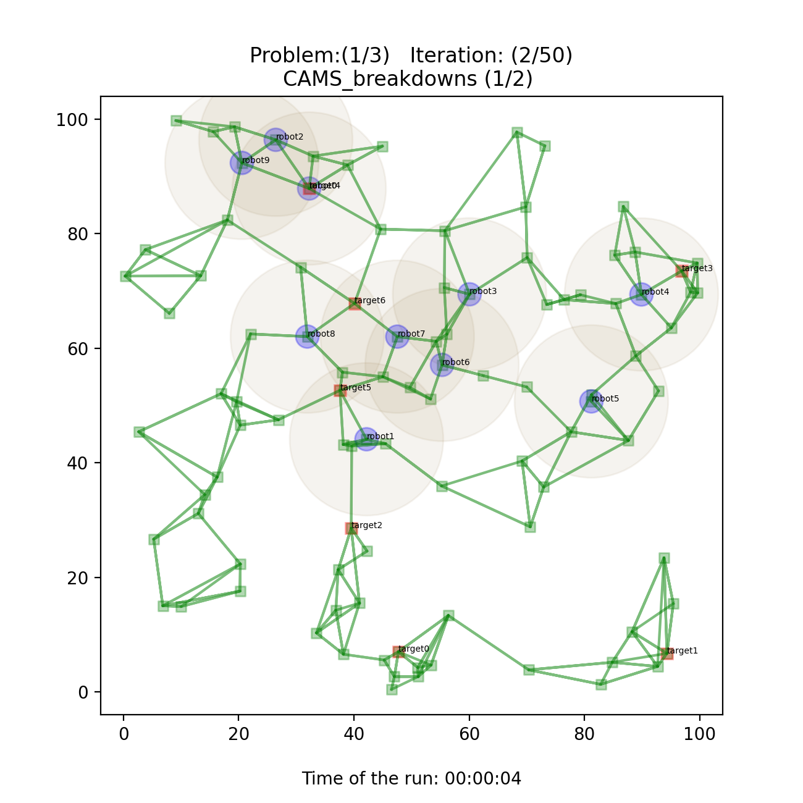
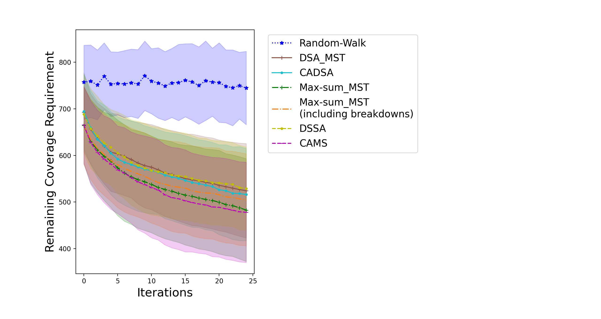
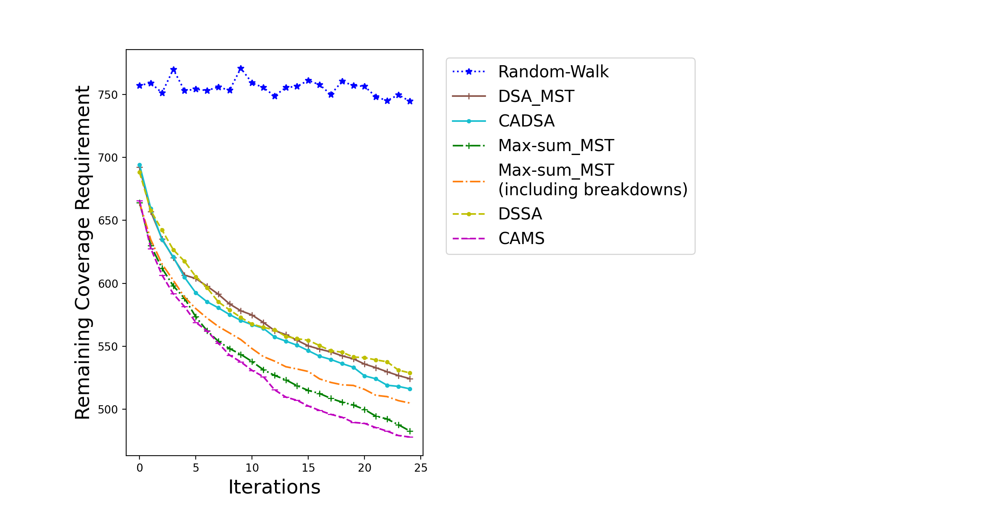
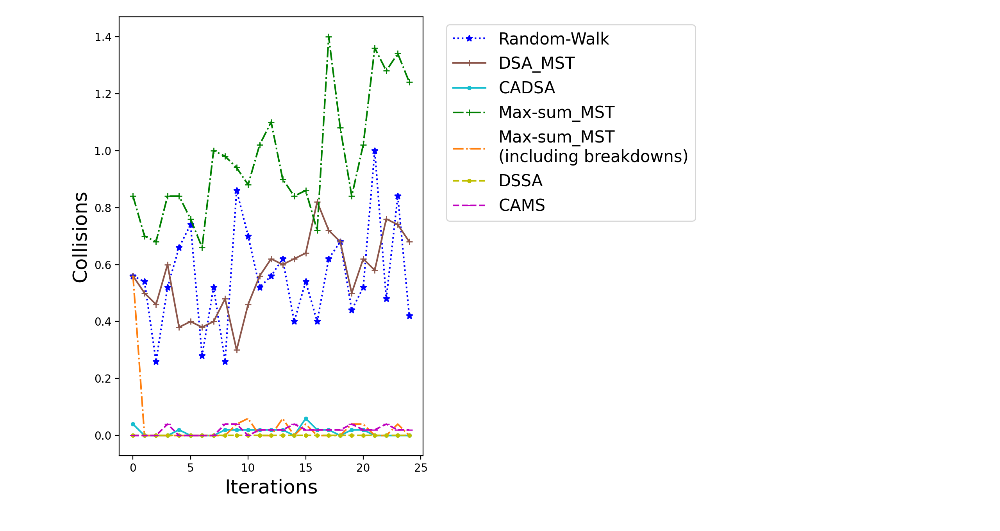

<h1 align="center"><a href="https://www.bgu.ac.il/~zivanr/files/DCOP_MST_JAAMAS.pdf" alt="">DCOP_MST</a> Simulator (Version 3)</h1>
<!-- [DCOP_MST](https://www.bgu.ac.il/~zivanr/files/DCOP_MST_JAAMAS.pdf) Simulator (Version 3) -->

    
    
    
    
    

## Contents

- [Small Simulations](#small-simulations)
- [Big Simulations](#big-simulations)
- [Results](#results)
- [Credits](#credits)

## Small Simulations
[(back)](#contents)

[Scenario Graphs](https://docs.google.com/presentation/d/19qJKU9vRQ1SmxZYmR9qyt2unhXwN3FUkiivTAfr2eWE/edit?usp=sharing)

### Output

#### Messages between agents. And their choices at the end of current iteration:

Example from Scenario 2.

    

#### The graph of chosen robots' positions (y axis) per iteration (x axis):

Example from Scenario 6.

    

## Big Simulations
[(back)](#contents)

### Tricks

#### Change `figsize` in `plt` mode

You need to plug `plt.rcParams["figure.figsize"] = [6.4, 6.4]` before plotting.

### Graph Example

    

### The Run of The Big Simulation

- Blue circles - robots
- Orange squares - targets
- Green  squares and edges - a graph of a problem

    

## Results
[(back)](#contents)

### Some graph examples:

    

    <h4>Graph1</h4>

<!--      -->
    
    <h4>Graph2</h4>

## Paper
[(back)](#contents)

___

## Credits
[(back)](#contents)

- [Scikit-Learn - NearestNeighbors](https://scikit-learn.org/stable/modules/generated/sklearn.neighbors.NearestNeighbors.html)
- [`abc` class - Python](https://docs.python.org/3/library/abc.html)
- [`prettytable` package](https://zetcode.com/python/prettytable/)
- [`matplotlib.pyplot.plot`](https://matplotlib.org/stable/api/_as_gen/matplotlib.pyplot.plot.html)
- [markers in `matplotlib`](https://matplotlib.org/stable/api/markers_api.html#module-matplotlib.markers)
- [colors in `matplotlib`](https://matplotlib.org/stable/gallery/color/named_colors.html)
- [Build-in Function in Python](https://docs.python.org/3/library/functions.html)
- [Badges in GitHub's README.md page via `shields.io`](https://shields.io/)
- [Choose an open source license | choosealicense.com](https://choosealicense.com/)

