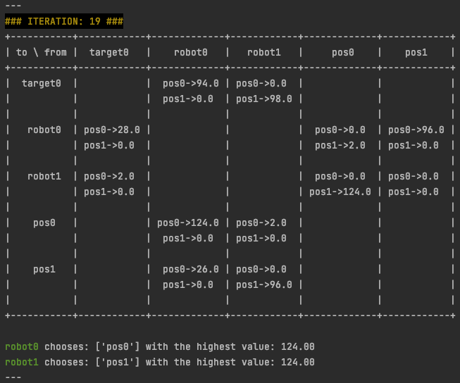
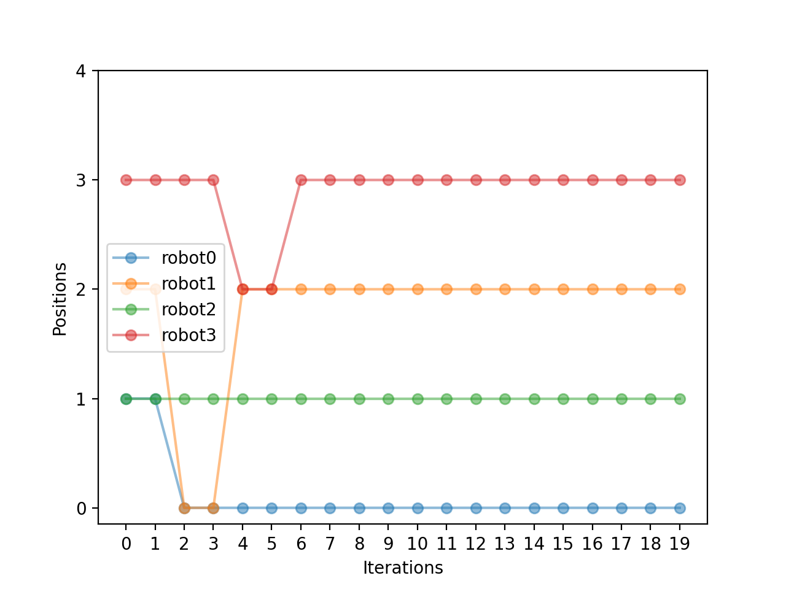
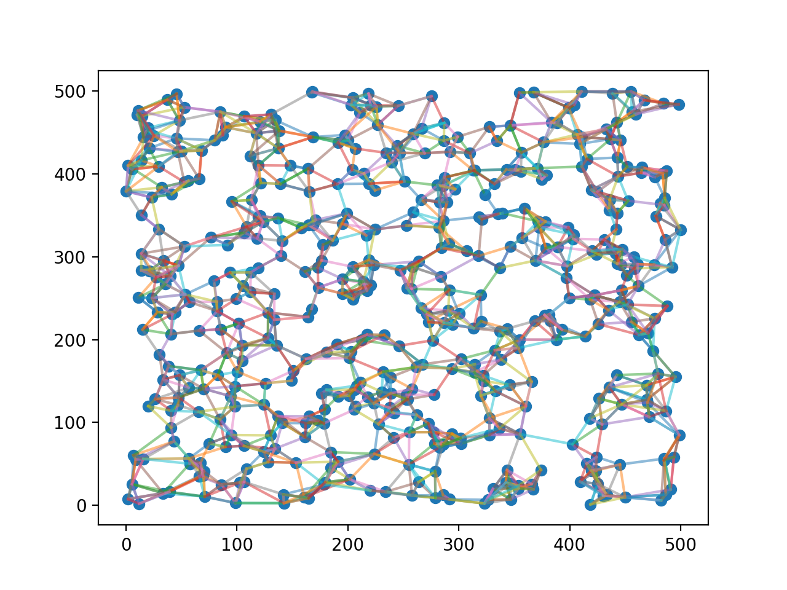

# [DCOP_MST](https://www.bgu.ac.il/~zivanr/files/DCOP_MST_JAAMAS.pdf) Simulator (Version 3)

    
    
    
    
    

## Small Simulations

[Scenario Graphs](https://docs.google.com/presentation/d/19qJKU9vRQ1SmxZYmR9qyt2unhXwN3FUkiivTAfr2eWE/edit?usp=sharing)

### Output

    

Messages between agents. And their choices at the end of current iteration.

    

The graph of those choices (y axis) per iteration (x axis).

## Big Simulations

### Tricks

#### Change `figsize` in `plt` mode

You need to plug `plt.rcParams["figure.figsize"] = [6.4, 6.4]` before plotting.

### Graph Example

## Results

## Paper

___

## Credits

- [Scikit-Learn - NearestNeighbors](https://scikit-learn.org/stable/modules/generated/sklearn.neighbors.NearestNeighbors.html)
- [`abc` class - Python](https://docs.python.org/3/library/abc.html)
- [`prettytable` package](https://zetcode.com/python/prettytable/)
- [`matplotlib.pyplot.plot`](https://matplotlib.org/stable/api/_as_gen/matplotlib.pyplot.plot.html)
- [markers in `matplotlib`](https://matplotlib.org/stable/api/markers_api.html#module-matplotlib.markers)
- [colors in `matplotlib`](https://matplotlib.org/stable/gallery/color/named_colors.html)
- [Build-in Function in Python](https://docs.python.org/3/library/functions.html)
- [Badges in GitHub's README.md page via `shields.io`](https://shields.io/)

